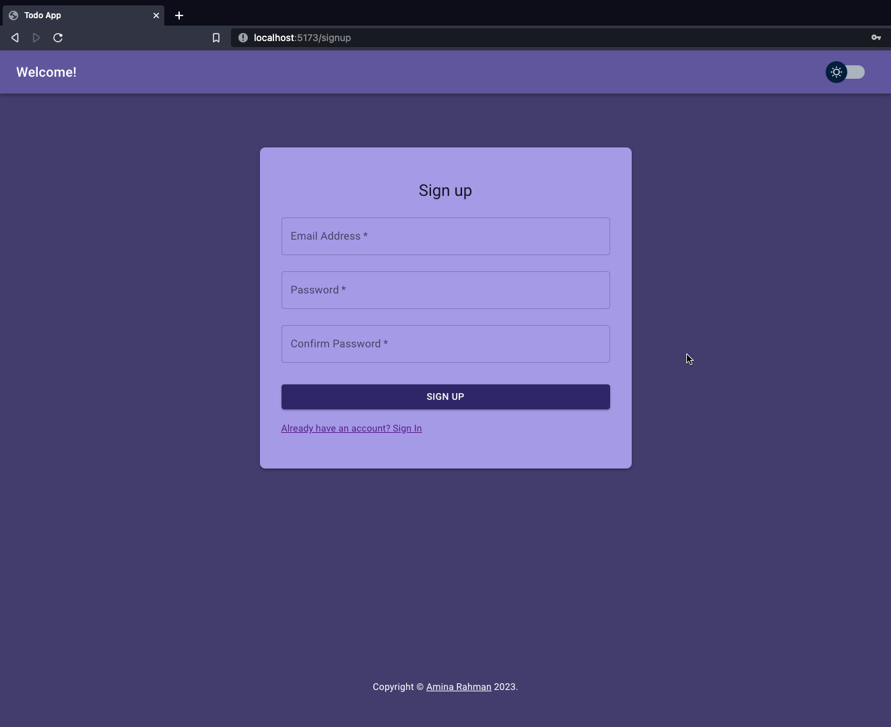
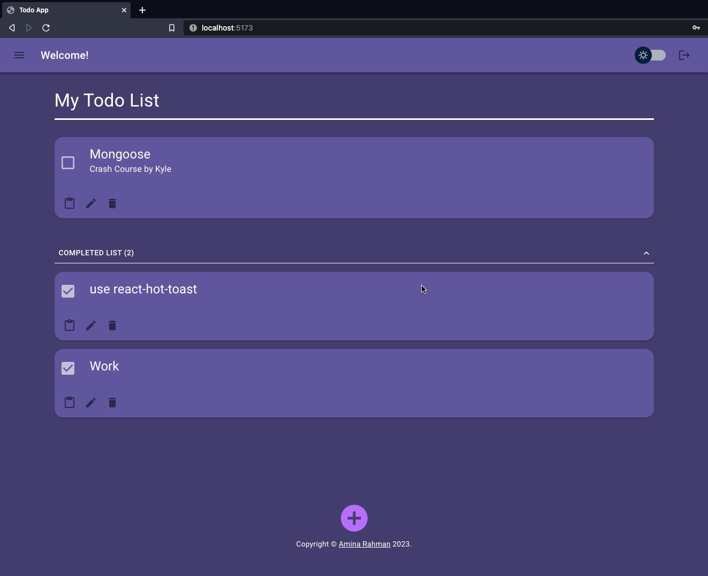
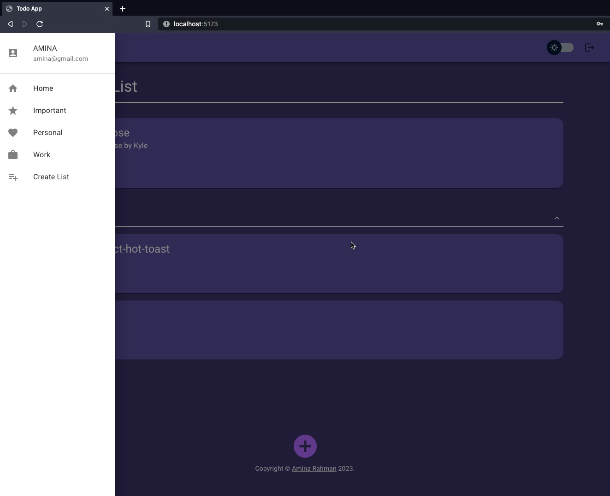
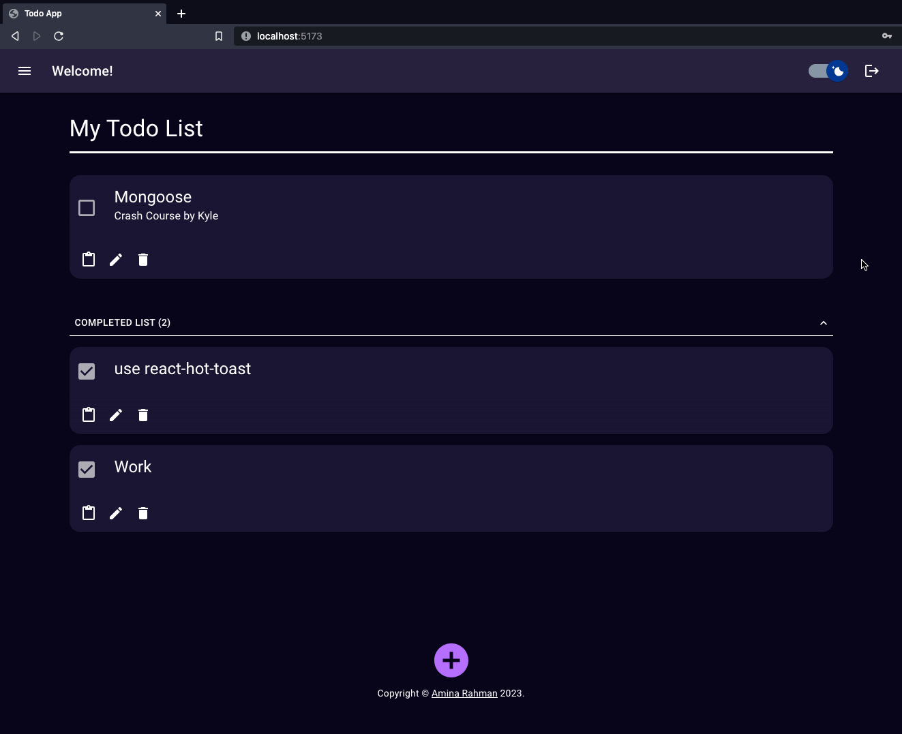
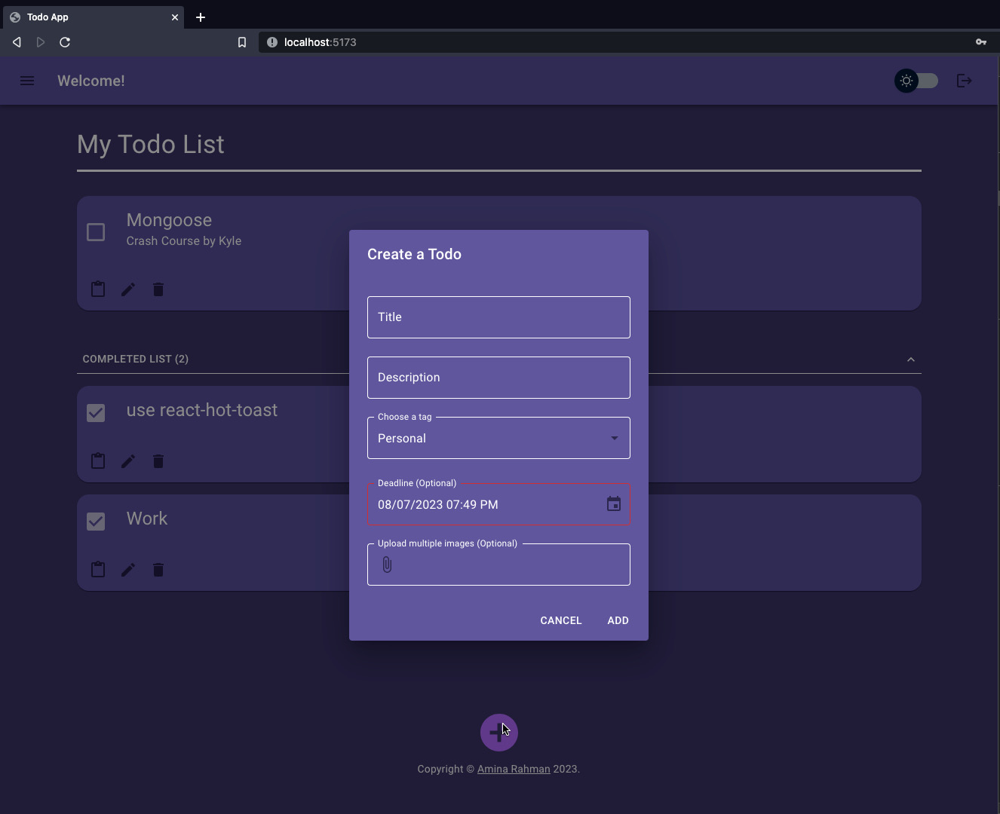

## Run locally

- Create a .env file and copy the following line 
```VITE_SERVER_URL='http://localhost:3002```
- In Terminal, start the dev server 
```npm install && npm run dev```

- Checkout the screenshots in the todo-ss.pdf file

## Backend
https://github.com/Nisha1205092/Todo-backend-EC2

## Features

- User can Sign-up, Sign-in
- Proper error messages during Sign-in and Sign-up are shown to the user
- User will remain signed-in, as authentication status is saved in the browser's local storage
- Select Light/Dark Theme, save theme setting locally, select theme setting based on user's settings
- Create, Edit, Delete, Copy to Clipboard and View Todos

## Future Features

- categorize todos by setting tags associated with each one
- add deadline and upload images
- filter todos based on text or tags

## Highlights

- Firebase for authentication
- Mongodb for saving todos
- Recoil for state management
- MUI for good looking accessible UI

## Tried but not finished

- Migrated almost 90% to Tanstack-Query (React-Query) for state management, instead of Recoil 
- Switched from Fetch API to Axios for easier error throwing. It worked, until I 
added Tanstack (AKA) React-Query





